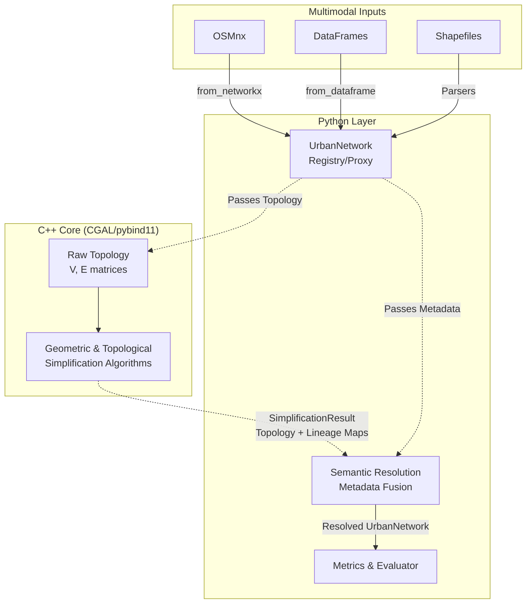

# ACJ: Urban Graph Acceleration & Simplification Framework


**ACJ** is a high-performance hybrid framework (C++/Python) designed for the semantic and topological simplification of large-scale urban networks. It safely decouples complex geometric operations from semantic data attributes, ensuring that metadata (e.g., speed limits, road names) survives massive graph reductions.

## System Architecture

The core philosophy of ACJ relies on treating `UrbanNetwork` as an invariant Registry/Proxy. Heavy geometric simplifications are sent to a highly optimized C++ core using CGAL. The core returns the simplified topology alongside strict lineage maps, which Python then uses to reconstruct and resolve semantic collisions.



## Installation Guide

### Prerequisites
You need a system with C++17 support, CMake, and the following libraries:
- **CGAL** (Computational Geometry Algorithms Library)
- **Boost**
- **pybind11**

On Ubuntu/Debian:
```bash
sudo apt-get update
sudo apt-get install cmake libcgal-dev libboost-all-dev
```
On Arch Linux:
```bash
sudo pacman -S cmake cgal boost pybind11
```

### Building the Package
We highly recommend setting up a virtual environment:

```bash
python -m venv venv
source venv/bin/activate
pip install -U pip setuptools wheel
```

Install the package in editable mode (which will trigger CMake build):

```bash
pip install -e .
```

## Quick Start (E2E Pipeline)

This demonstrates the end-to-end pipeline: extracting raw data, parsing, executing a highly optimized topological simplification, and calculating compression metrics.

```python
import osmnx as ox
from acj import UrbanNetwork, ACJTopologicalEvaluator
from acj import CompressionRatioMetric, SemanticSpeedDistortionMetric

# 1. Ingest Data (Raw Graph)
G = ox.graph_from_place("Barranco, Lima, Peru", network_type="drive")

# 2. Parse into Multimodal Registry
network = UrbanNetwork.from_networkx(G)
print("Initial:", network)

# 3. Setup Metrics and Evaluator
metrics = [CompressionRatioMetric(), SemanticSpeedDistortionMetric()]
evaluator = ACJTopologicalEvaluator(network, metrics)

# 4. Evaluate (C++ Topo Simplification + Semantic Resolution)
results = evaluator.evaluate()

print("Results:", results)
print("Simplified:", evaluator.simplified_network)
```

## Module Structure (API Reference)

### `acj.core` (The Heart of the Framework)
This module acts as the central orchestrator for data decoupling.
- **`UrbanNetwork`**: The fundamental data structure of the library. It stores raw network topologies in heavily optimized Pandas DataFrames alongside dictionaries of semantic metadata. Supports multimodal ingestion from `NetworkX`, `osmnx`, or arbitrary DataFrames.
- **`resolve_semantics()`**: The pure Python metadata fusion engine. When a graph is collapsed by C++, this function takes the topological lineage map and automatically resolves semantic collisions (e.g., averaging max speeds or concatenating street names) to keep information loss at 0.

### `acj.algorithms` (Python Wrappers & Indexing)
- **`graph` / `minkowski`**: Wrappers for invoking our low-level C++ simplification procedures. Here you'll find interfaces for topological simplifications, geometric clustering, Minkowski-sum reductions, and more.
- **`MapIndex`**: An advanced spatial querying interface wrapping CGAL spatial trees, enabling fast nearest-neighbor point-to-graph assignments (essential for crime mapping or event correlation on large networks).

### `acj.data` (Data Binding & IO)
- **`SimplificationResult`**: The critical struct generated and bound directly from pybind11. It holds the new `GraphData` topology alongside `.node_lineage` and `.edge_lineage` dictionaries linking new entities back to their original IDs.
- **`GraphData`**: Internal lightweight wrapper handling node/edge validations before passing arrays down to C++.

### `acj.evaluation` (Research & Metrics Engine)
- **`BaseEvaluator` / `ACJTopologicalEvaluator`**: Automates the simplification lifecycle. These evaluators accept a raw `UrbanNetwork`, inject it into C++ for reduction, apply the semantic resolution layer, and systematically test the results against predefined metrics.
- **`CompressionRatioMetric` / `SemanticSpeedDistortionMetric`**: Pluggable metrics allowing researchers to quantitatively evaluate exactly how much data is compressed and what percentage of the semantic truth (like speed distributions) is distorted during network abstraction.
